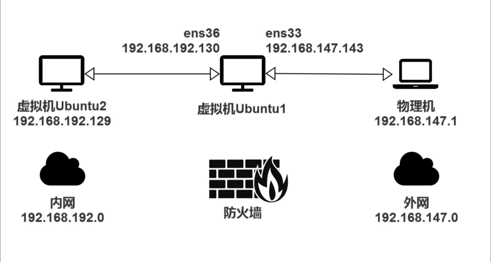
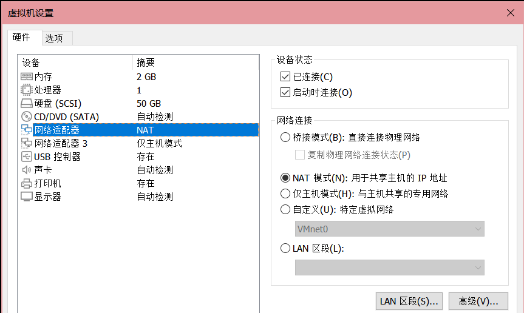
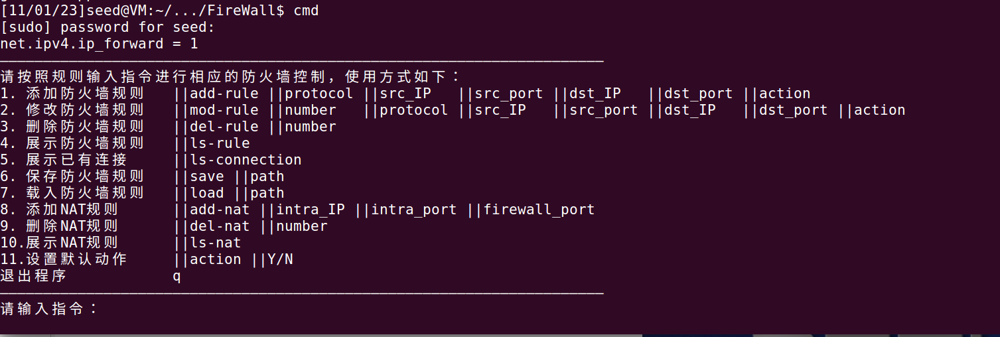

# Firewall

## Requirement

### Environment

内网与防火墙主机为虚拟机；外网主机为物理机。



### Firewall Configuration

开启ip转发。

```bash
sudo echo 1 > /proc/sys/net/ipv4/ip_forward 
```

添加网络适配器，使两个适配器一个为仅主机模式模拟内网，与内网虚拟机通信；另一个为NAT模式模拟外网，与外网物理机通信。



### Intranet Host Configuration

配置默认路由，使得防火墙内网IP为默认网关，通信需走防火墙。

```bash
sudo route add default gw 192.168.192.130 eth0    
```

### Extranet Host Configuration

配置默认路由，使得外网与内网通信均需经过防火墙。

```bash
#需替换为内网与防火墙外网ip
route add -p 192.168.192.0 mask 255.255.255.0 192.168.147.143 metric 2 
```

## Installation

源代码放在Ubuntu16虚拟机。

进入FireWall源文件夹，编译。

```bash
make
```

运行命令cmd即可启动防火墙（自动插入模块，无需手动）。

q退出防火墙（自动卸载模块，无需手动）。

```bash
cmd
```


